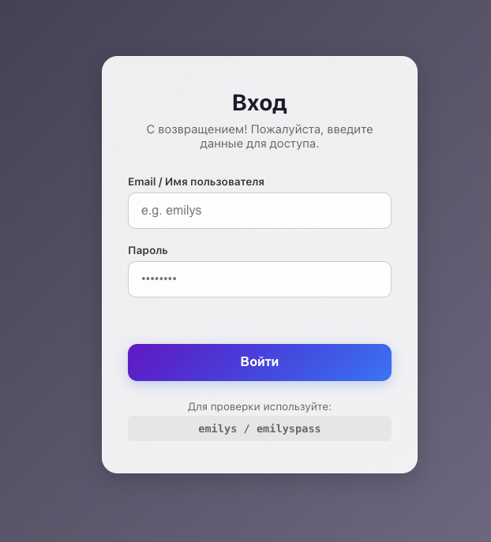
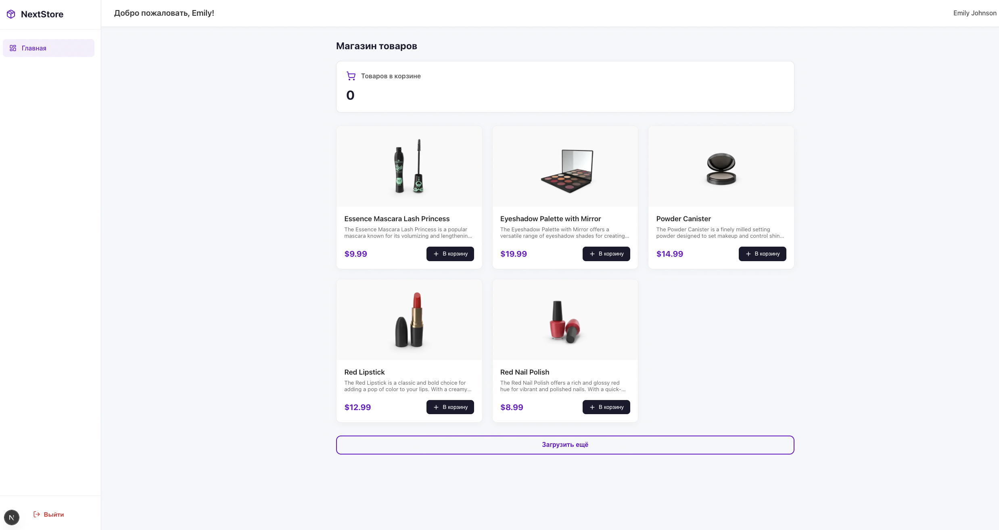

# NextStore — E-Commerce Dashboard

Next.js 16 приложение с авторизацией, автоматическим обновлением JWT-токенов и каталогом товаров.

---

## Стек

- **Next.js 16** (App Router, Turbopack)
- **React 19** — `useActionState`, `useOptimistic`, `useTransition`
- **TypeScript**
- **DummyJSON** — REST API для авторизации, товаров и корзин

---

## Возможности

- Авторизация с хранением токенов в `httpOnly`-куках
- Автоматический refresh access-токена при истечении срока — без участия пользователя
- Single refresh при параллельных запросах с изоляцией между сессиями
- SSR-загрузка данных: информация о пользователе, корзина, первые 5 товаров
- Пагинация товаров — «Загрузить ещё»
- Добавление товара в корзину с оптимистичным обновлением UI
- Toast-уведомления об успехе и ошибках
- Защищённые и публичные маршруты через `proxy.ts`

---

## Архитектура

Все обращения к API идут **только через серверную часть** — Server Components и Server Actions. Прямые запросы браузер → API исключены.

```
src/
├── app/
│   ├── login/
│   │   ├── actions.ts          # Server Action: loginAction, logoutAction
│   │   ├── components/loginForm/
│   │   └── page.tsx
│   ├── dashboard/
│   │   ├── actions.ts          # Server Actions: fetchProductsAction, addToCartAction
│   │   ├── components/
│   │   │   ├── dashboardClient/ # Client Component — интерактивность
│   │   │   ├── header/
│   │   │   └── sidebar/
│   │   ├── error.tsx           # Error boundary для страницы
│   │   ├── layout.tsx          # SSR: загрузка данных пользователя
│   │   └── page.tsx            # SSR: загрузка товаров и корзины
│   ├── error.tsx               # Глобальный error boundary
│   └── layout.tsx
├── lib/
│   ├── api.ts                  # apiFetch — единая точка входа для API, retry при 401
│   └── auth.ts                 # executeRefresh с защитой от параллельных запросов
├── proxy.ts                    # Middleware: защита маршрутов, refresh токенов
└── types/index.ts
```

---

## Маршруты

| Путь         | Доступ     | Описание                                                   |
| ------------ | ---------- | ---------------------------------------------------------- |
| `/`          | —          | Редирект: на `/dashboard` если авторизован, иначе `/login` |
| `/login`     | Публичный  | Форма входа                                                |
| `/dashboard` | Защищённый | Каталог товаров, корзина                                   |

---

## Token Refresh

Refresh происходит в двух местах:

1. **`proxy.ts`** — перед каждым запросом к защищённому маршруту. Если токен истёк, обновляет его и продолжает запрос прозрачно для пользователя.
2. **`apiFetch`** — если API вернул `401` в процессе SSR или Server Action. Делает retry с новым токеном без уведомления пользователя. При невозможности обновить токены — редирект на `/login`.

```
Параллельные запросы с истёкшим токеном
        │
        ▼
refreshLocks.get(refreshToken)  ──exists──▶ ожидает существующий Promise
        │
      новый
        │
        ▼
   POST /auth/refresh
        │
   ┌────┴────┐
  ok        fail
   │          │
  новые     redirect
  токены    /login
```

---

## Запуск

```bash
npm install
npm run dev
```

Приложение доступно на [http://localhost:3000](http://localhost:3000).

**Тестовые данные для входа:**

```
username: emilys
password: emilyspass
```

---

## Скриншоты

### Страница входа



### Dashboard



### Toast


---

## API

**Base URL:** `https://dummyjson.com`

| Эндпоинт                | Метод | Описание                    |
| ----------------------- | ----- | --------------------------- |
| `/auth/login`           | POST  | Авторизация                 |
| `/auth/refresh`         | POST  | Обновление токенов          |
| `/auth/me`              | GET   | Данные пользователя         |
| `/auth/products`        | GET   | Список товаров              |
| `/auth/carts/user/{id}` | GET   | Корзины пользователя        |
| `/auth/carts/add`       | POST  | Добавление товара в корзину |
